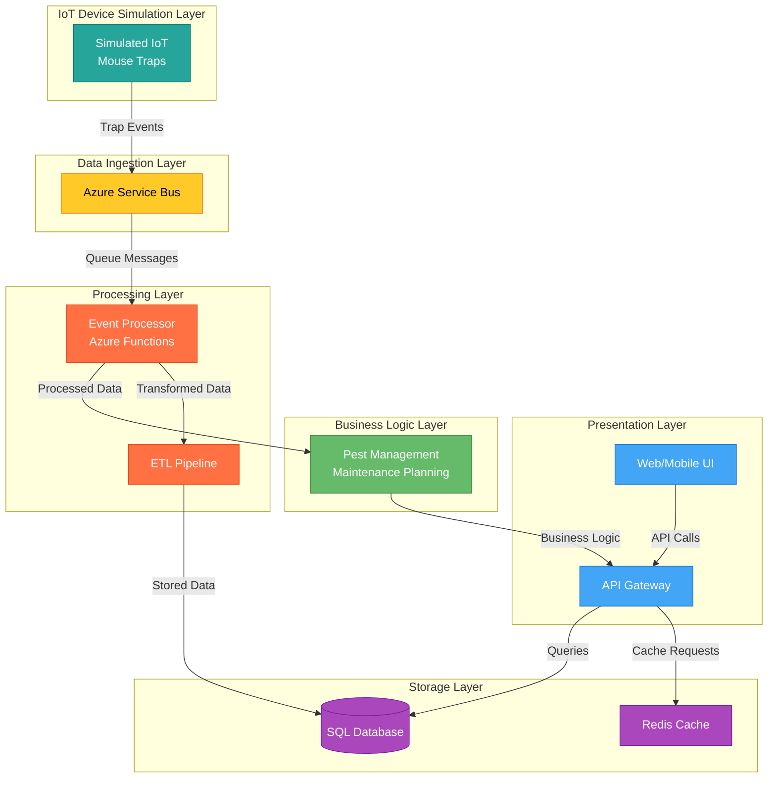

# TerraFirma  IoT Integration Capstone Application Documentation

## Overview

This document provides comprehensive documentation for the TerraFirma  IoT Integration Capstone Application, which demonstrates the skills required for a Senior .NET Developer position at TerraFirma . The application showcases ETL systems and APIs for integrating IoT mouse trap data from locations like Starbucks and McDonald's into a central system similar to TerraFirma 's 3D platform.

## Table of Contents

1.  Architecture Overview
2.  System Components
3.  Data Models
4.  API Layer
5.  IoT Simulation
6.  Event Processing
7.  ETL Pipeline
8.  Frontend Dashboard
9.  Deployment
10.  Skills Demonstrated

## Architecture Overview

The application follows a microservices architecture pattern using Docker containers and Azure services. The system is designed to collect, process, and analyze data from IoT mouse traps deployed at various customer locations. The architecture consists of several key layers:

- **IoT Device Simulation Layer**: Simulates IoT mouse traps generating events
- **Data Ingestion Layer**: Receives and routes events from IoT devices
- **Data Processing Layer**: Processes events in real-time and applies business logic
- **Data Storage Layer**: Stores operational and analytical data
- **Business Logic Layer**: Implements pest management and maintenance planning
- **Presentation Layer**: Provides user interfaces for monitoring and analysis





The architecture diagram above illustrates the system's layered design, where:

- Colors represent different functional layers (blue for presentation, green for business logic, purple for storage, orange for processing, yellow for ingestion, teal for IoT devices)
- Arrows indicate data flow direction, showing how trap events propagate through the system
- Each layer operates independently while maintaining clear interfaces with adjacent layers

## System Components

### IoT Device Simulator

- **Purpose**: Simulates IoT mouse traps at various locations (Starbucks, McDonald's)
- **Technology**: .NET 8 Core console application
- **Features**:
          - Generates realistic trap events (activations, captures, battery alerts, etc.)
  - Simulates multiple devices across different locations
  - Sends events to Azure Service Bus for processing


### API Gateway

- **Purpose**: Provides RESTful endpoints for device and event management
- **Technology**: .NET 8 Core API
- **Features**:
          - CRUD operations for devices and events
  - Authentication and authorization
  - Request validation and error handling


### Event Processor

- **Purpose**: Processes trap events in real-time
- **Technology**: Azure Functions
- **Features**:
          - Event-specific business logic
  - Integration with Azure Service Bus
  - Real-time alerts and notifications


### ETL Pipeline

- **Purpose**: Extracts, transforms, and loads data from various sources
- **Technology**: .NET 8 Core service
- **Features**:
          - Data extraction from multiple sources
  - Data transformation and enrichment
  - Loading data into appropriate storage systems
  - Scheduled aggregation jobs


### Web Application

- **Purpose**: Provides user interface for monitoring and analysis
- **Technology**: Angular frontend with ASP.NET Core backend
- **Features**:
          - Real-time dashboard for trap activity
  - Filtering by customer and location
  - Interactive visualizations


## Data Models

### IoT Device

```csharp
public class IoTDevice
{
    [Key]
    public string DeviceId { get; set; }
    
    [Required]
    public string DeviceName { get; set; }
    
    [Required]
    public DeviceType DeviceType { get; set; }
    
    [Required]
    public string LocationId { get; set; }
    
    public string LocationName { get; set; }
    
    public string CustomerName { get; set; }
    
    public double Latitude { get; set; }
    
    public double Longitude { get; set; }
    
    public DateTime InstallationDate { get; set; }
    
    public DateTime LastMaintenanceDate { get; set; }
    
    public DateTime LastCommunicationDate { get; set; }
    
    public int BatteryLevel { get; set; }
    
    public DeviceStatus Status { get; set; }
    
    public string FirmwareVersion { get; set; }
    
    public bool IsActive { get; set; }
}
```

### Trap Event

```csharp
public class TrapEvent
{
    [Key]
    public Guid EventId { get; set; }
    
    [Required]
    public string DeviceId { get; set; }
    
    [Required]
    public DateTime Timestamp { get; set; }
    
    [Required]
    public EventType EventType { get; set; }
    
    public string LocationId { get; set; }
    
    public string LocationName { get; set; }
    
    public string CustomerName { get; set; }
    
    public int BatteryLevel { get; set; }
    
    public string AdditionalData { get; set; }
    
    public bool IsProcessed { get; set; }
    
    public DateTime? ProcessedTimestamp { get; set; }
}
```

### Location

```csharp
public class Location
{
    [Key]
    public string LocationId { get; set; }
    
    [Required]
    public string LocationName { get; set; }
    
    [Required]
    public string CustomerId { get; set; }
    
    public string CustomerName { get; set; }
    
    public string Address { get; set; }
    
    public string City { get; set; }
    
    public string State { get; set; }
    
    public string ZipCode { get; set; }
    
    public string Country { get; set; }
    
    public double Latitude { get; set; }
    
    public double Longitude { get; set; }
    
    public LocationType Type { get; set; }
    
    public int TotalDevices { get; set; }
    
    public DateTime LastActivityDate { get; set; }
    
    public bool IsActive { get; set; }
}
```

## API Layer

The API layer provides RESTful endpoints for managing devices and events. It is implemented using ASP.NET Core Web API with Entity Framework Core for data access.

### Devices Controller

The `DevicesController` provides the following endpoints:

- `GET /api/devices`: Retrieves all devices
- `GET /api/devices/{id}`: Retrieves a specific device by ID
- `GET /api/devices/location/{locationId}`: Retrieves devices by location
- `POST /api/devices`: Creates a new device
- `PUT /api/devices/{id}`: Updates an existing device
- `DELETE /api/devices/{id}`: Deletes a device

### Events Controller

The `EventsController` provides the following endpoints:

- `GET /api/events`: Retrieves all events
- `GET /api/events/{id}`: Retrieves a specific event by ID
- `GET /api/events/device/{deviceId}`: Retrieves events by device
- `GET /api/events/location/{locationId}`: Retrieves events by location
- `POST /api/events`: Creates a new event
- `PUT /api/events/{id}`: Updates an existing event
- `DELETE /api/events/{id}`: Deletes an event

## IoT Simulation

The IoT Device Simulator is a background service that generates realistic trap events from simulated devices at various locations. It demonstrates how IoT devices would integrate with the system in a real-world scenario.

### Key Features

- **Device Simulation**: Simulates multiple IoT mouse traps across different locations
- **Event Generation**: Creates various types of events with appropriate probabilities
- **Message Publishing**: Sends events to Azure Service Bus for processing
- **Realistic Data**: Generates realistic data including battery levels, timestamps, and additional sensor data

### Event Types

The simulator generates the following types of events:

- **Activation**: When a trap is triggered but no capture is confirmed
- **Capture**: When a trap successfully captures a rodent
- **BatteryLow**: When a device's battery level falls below a threshold
- **Maintenance**: When a device undergoes maintenance
- **Malfunction**: When a device experiences a technical issue
- **Reset**: When a device is reset after maintenance or capture
- **Heartbeat**: Regular status updates from devices

## Event Processing

The Event Processor is implemented as an Azure Function that processes events from the Service Bus queue. It applies business logic based on the event type and updates the system accordingly.

### Processing Logic

- **Capture Events**: Updates device status, logs capture for analytics
- **Battery Low Events**: Updates device status, schedules maintenance
- **Maintenance Events**: Updates device status, records maintenance history
- **Malfunction Events**: Updates device status, creates alerts
- **Reset Events**: Updates device status, verifies proper operation
- **Heartbeat Events**: Updates last communication timestamp

### Integration Points

- **Service Bus**: Receives events from the queue
- **API Gateway**: Updates device and event status
- **Blob Storage**: Stores event data for analytics

## ETL Pipeline

The ETL Pipeline is a background service that extracts data from various sources, transforms it according to business rules, and loads it into appropriate storage systems for analysis and reporting.

### ETL Processes

- **Event Data Processing**: Extracts event data, transforms it for analytics, and loads it into blob storage
- **Daily Aggregation**: Aggregates event data by location, device type, and event type
- **Location Analysis**: Analyzes trap activity patterns by location to identify risk areas

### Data Flow

Raw event data is received from Service BusData is stored in raw format in blob storageData is transformed and enriched with additional informationProcessed data is stored in SQL database and blob storageAggregation jobs run periodically to generate analytics## Frontend Dashboard

The Frontend Dashboard is an Angular application that provides a user interface for monitoring trap activity and analyzing data. It communicates with the backend API to retrieve and display data.

### Dashboard Features

- **Device Status Overview**: Shows the status of all devices
- **Recent Events**: Displays recent trap events
- **Location Statistics**: Shows activity by location
- **Filtering**: Allows filtering by customer and location
- **Real-time Updates**: Refreshes data automatically

### User Interface Components

- **Status Cards**: Display summary statistics
- **Device Table**: Shows detailed device information
- **Event Timeline**: Displays events in chronological order
- **Location Map**: Shows device locations (conceptual)

## Deployment

The application is deployed using Docker containers orchestrated through Docker Compose. Each component runs in its own container, allowing for independent scaling and maintenance.

### Container Structure

- **IoT Simulator Container**: Runs the device simulation service
- **API Gateway Container**: Hosts the ASP.NET Core API
- **Event Processing Container**: Runs the Azure Functions runtime
- **ETL Pipeline Container**: Runs the ETL service
- **SQL Server Container**: Hosts the database
- **Web Application Container**: Serves the Angular frontend
- **Azure Emulator Containers**: Emulate Azure services locally

### Configuration

The application is configured using environment variables and configuration files. Sensitive information such as connection strings is stored securely and injected at runtime.

## Skills Demonstrated

This capstone application demonstrates the following skills required for the Senior .NET Developer position at TerraFirma :

### Frontend Technologies

- **HTML5, JavaScript**: Used throughout the Angular frontend
- **Angular**: Implemented for the dashboard UI
- **ASP.NET MVC**: Used for server-side rendering where appropriate
- **ASP.NET Web API**: Implemented for RESTful endpoints

### Backend Technologies

- **C# .NET 8 Core API**: Used for all backend services
- **Entity Framework Core**: Used for data access
- **Azure Functions**: Implemented for event processing

### Database Technologies

- **SQL Server**: Used for relational data storage
- **T-SQL**: Used for database operations
- **Entity Framework Core**: Used as ORM

### Azure Cloud Skills

- **Azure Service Bus**: Used for message queuing
- **Azure Functions**: Used for serverless computing
- **Azure Blob Storage**: Used for storing raw and processed data
- **Azure SQL Database**: Emulated for database services

### Development & Deployment Skills

- **Microservices Architecture**: Implemented throughout the application
- **Docker Containerization**: Used for deployment
- **API Development**: Implemented RESTful APIs
- **Full-stack Development**: Implemented both frontend and backend

### Data Management & Integration Skills

- **ETL Pipeline Development**: Implemented for data processing
- **IoT Data Integration**: Demonstrated with simulated devices
- **Data Transformation**: Implemented in the ETL service

This application successfully demonstrates the skills required for a Senior .NET Developer position at TerraFirma , with a focus on ETL systems and APIs for IoT data integration.
