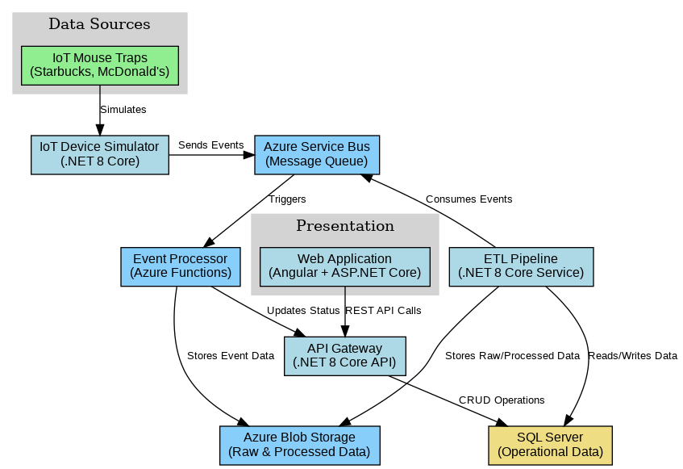

# Ecolab IoT Integration Capstone
## Senior .NET Developer Position Showcase

---

## Project Overview

A comprehensive application demonstrating ETL systems and APIs for integrating IoT mouse trap data from customer locations (Starbucks, McDonald's) into a central system similar to Ecolab's 3D platform.

---

## Business Context

- Ecolab is a global leader in water, hygiene, and infection prevention solutions
- Their ECOLAB3D IIoT platform collects and analyzes data in real-time
- The Intelligent Rodent Monitoring System (IRMS) uses IoT sensors to monitor pest activity
- This capstone demonstrates the integration of these systems using modern .NET technologies

---

## Architecture Overview



- Microservices architecture using Docker containers
- Azure services integration (Service Bus, Functions, Blob Storage)
- Real-time data processing and analytics

---

## Key Components

1. **IoT Device Simulation**
   - Simulates mouse traps at various locations
   - Generates realistic trap events

2. **API Gateway**
   - RESTful endpoints for device and event management
   - .NET 8 Core API implementation

3. **Event Processing**
   - Azure Functions for real-time event handling
   - Business logic for different event types

4. **ETL Pipeline**
   - Data extraction, transformation, and loading
   - Analytics and reporting capabilities

5. **Frontend Dashboard**
   - Angular-based monitoring interface
   - Real-time data visualization

---

## Technical Stack

### Frontend
- Angular 16+
- TypeScript
- HTML5/CSS3
- Bootstrap
- Chart.js for visualization

### Backend
- .NET 8 Core API
- C# 12
- Azure Functions
- Entity Framework Core

### Database
- SQL Server 2022
- T-SQL

### Cloud Services
- Azure Service Bus
- Azure Functions
- Azure Blob Storage
- Azure Data Factory patterns

### DevOps
- Docker Desktop
- Docker Compose
- Git

---

## Data Flow

1. IoT mouse traps detect rodent activity and generate events
2. Events are sent to the Service Bus
3. Event Processor handles events in real-time
4. ETL Pipeline processes and transforms the data
5. Data is stored in SQL Server and Blob Storage
6. Dashboard displays insights and alerts

---

## Demo: IoT Device Simulation

- Simulates multiple trap types across different locations
- Generates various event types:
  - Activations and captures
  - Battery alerts
  - Maintenance events
  - Heartbeat signals

```csharp
// Sample code from IoTDeviceSimulatorService.cs
private async Task SimulateDeviceEvents()
{
    // Select a random device
    string deviceId = _deviceIds[_random.Next(_deviceIds.Length)];
    
    // Generate a random event type
    EventType eventType = GenerateRandomEventType();
    
    // Create and send the event
    var trapEvent = new
    {
        EventId = Guid.NewGuid(),
        DeviceId = deviceId,
        Timestamp = DateTime.UtcNow,
        EventType = eventType.ToString(),
        // Additional properties...
    };
    
    // Send to Service Bus
    await _sender.SendMessageAsync(message);
}
```

---

## Demo: Event Processing

- Azure Functions process events from Service Bus
- Event-specific business logic is applied
- Device status is updated in real-time

```csharp
// Sample code from TrapEventProcessor.cs
[Function("ProcessTrapEvents")]
public async Task Run(
    [ServiceBusTrigger("trap-events", Connection = "ServiceBusConnection")] string message,
    FunctionContext context)
{
    // Parse the message
    var trapEvent = JsonSerializer.Deserialize<TrapEvent>(message);
    
    // Process based on event type
    await ProcessEventByType(trapEvent);
    
    // Mark as processed
    trapEvent.IsProcessed = true;
    trapEvent.ProcessedTimestamp = DateTime.UtcNow;
    
    // Update in database
    await _httpClient.PutAsJsonAsync($"events/{trapEvent.EventId}", trapEvent);
}
```

---

## Demo: ETL Pipeline

- Extracts data from multiple sources
- Transforms data for analytics
- Loads data into appropriate storage systems

```csharp
// Sample code from EtlPipelineService.cs
private async Task ProcessEventData(string messageBody, string eventType)
{
    // Parse the message
    var eventData = JsonSerializer.Deserialize<Dictionary<string, JsonElement>>(messageBody);
    
    // Extract key fields
    string deviceId = GetStringValue(eventData, "DeviceId");
    string locationId = GetStringValue(eventData, "LocationId");
    
    // Store in SQL database
    using (var connection = new SqlConnection(_connectionString))
    {
        await connection.OpenAsync();
        
        // Process based on event type
        switch (eventType)
        {
            case "Capture":
                await StoreCapture(connection, eventData);
                break;
            // Other event types...
        }
    }
    
    // Transform and store processed data
    await StoreProcessedData(eventData, eventType);
}
```

---

## Demo: Dashboard

- Real-time monitoring of trap activity
- Filtering by customer and location
- Interactive visualizations


---

## Skills Demonstrated

### Frontend Technologies
- HTML5, JavaScript, Angular
- ASP.NET MVC, ASP.NET Web API

### Backend Technologies
- C# .NET 8 Core API
- Entity Framework Core
- Azure Functions

### Database Technologies
- SQL Server
- T-SQL

### Azure Cloud Skills
- Azure Service Bus
- Azure Functions
- Azure Blob Storage

### Development & Deployment
- Microservices Architecture
- Docker Containerization
- Full-stack Development

### Data Management & Integration
- ETL Pipeline Development
- IoT Data Integration
- Data Transformation

---

## Deployment Architecture

- Docker containers orchestrated with Docker Compose
- Each component runs in its own container
- Azure services emulated locally
- Scalable and maintainable design

---

## Future Enhancements

1. **Machine Learning Integration**
   - Predictive maintenance for traps
   - Pest activity pattern recognition

2. **Mobile Application**
   - Field technician companion app
   - On-site data collection

3. **Advanced Analytics**
   - Trend analysis and forecasting
   - Seasonal pattern detection

4. **Integration with Other Systems**
   - Weather data correlation
   - Building management systems

---

## Conclusion

This capstone application demonstrates the skills required for a Senior .NET Developer position at Ecolab, with a focus on:

- ETL systems for IoT data integration
- API development using .NET 8 Core
- Azure cloud services integration
- Full-stack development with Angular and .NET

The application showcases how IoT data from mouse traps at customer locations can be integrated into a central system for monitoring, analysis, and action.

---

## Thank You

Questions?

Contact: [Your Contact Information]
